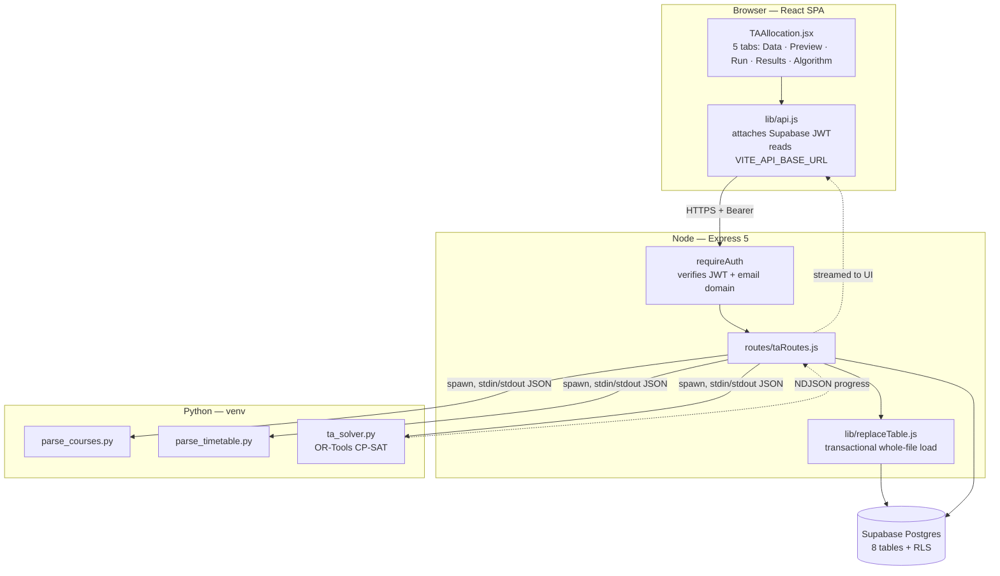
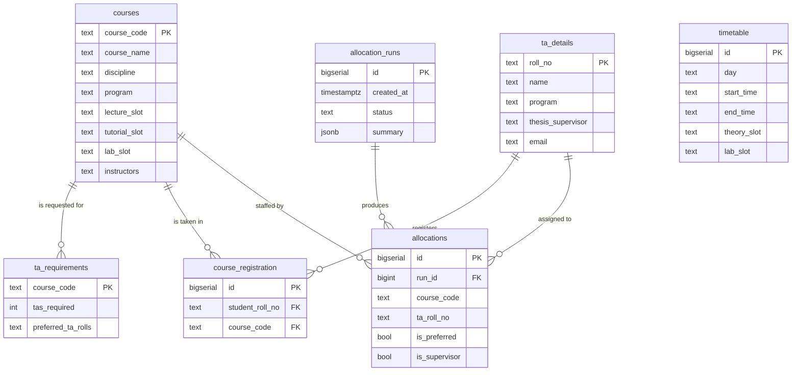
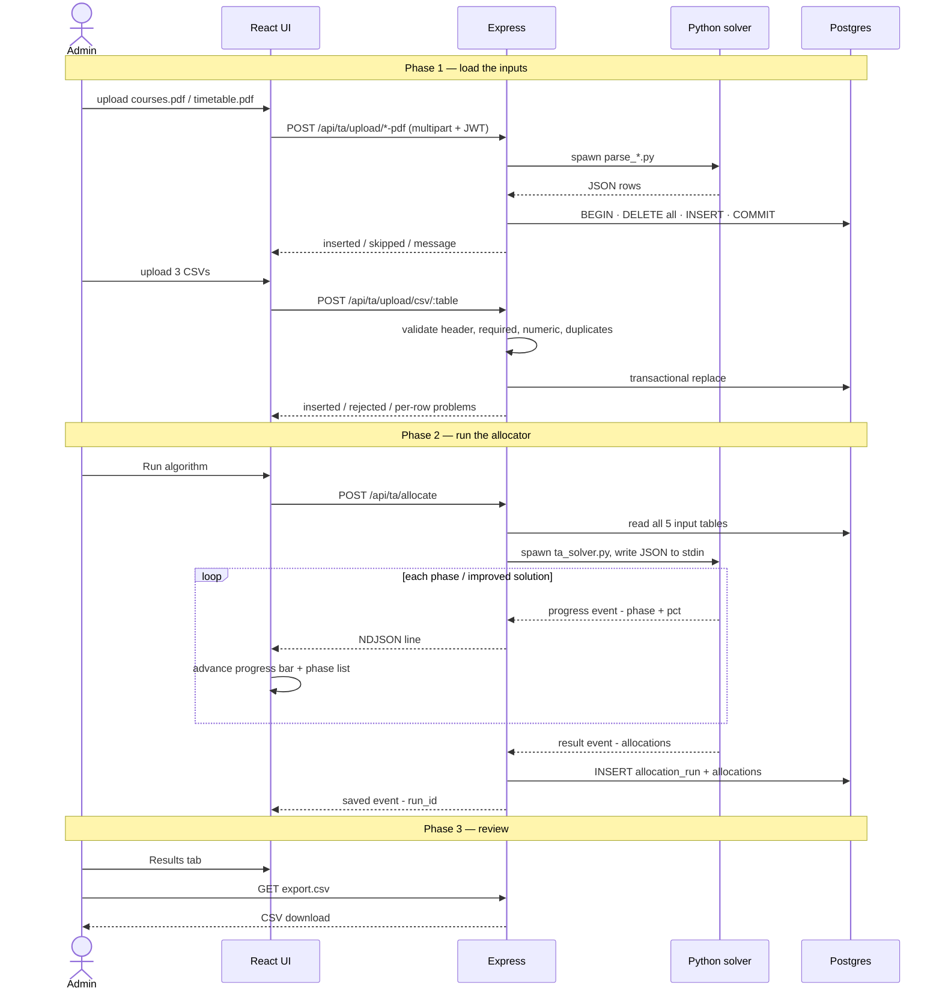

# CSDesk — TA Allocation Module

Technical reference for the Teaching Assistant allocation subsystem: what it
does, how it is built, and the reasoning behind the design decisions.

---

## 1. The problem

Every semester the CSE department has to attach teaching assistants (M.Tech and
PhD students) to the courses that need them.

1. **Each professor** submits a demand for a course: *"I need 5 TAs, and I'd
   like Ram, Shyam, Rahul, ABC, XYZ."*
2. **The admin** collects every professor's demand and assigns TAs across all
   courses, respecting who is actually free and who is asking for whom.

Doing this by hand is slow and error-prone, because the three rules interact:

| # | Rule | Why it is hard |
|---|---|---|
| 1 | Every course that asks for a TA must get **at least one** | Demand can exceed the free pool |
| 2 | A TA must be **free** at the course's teaching times | Requires resolving two PDFs into a shared time grid |
| 3 | When two professors want the same TA and their courses **clash in time**, the TA's **thesis supervisor** wins | Decisions chain — resolving one contest changes the next |
| 4 | If demand exceeds supply, it must be fulfilled **proportionally** (e.g. assigning 1 TA to a course requesting 10, and 10 to a course requesting 100) | Requires non-linear or stepped marginal rewards to balance fulfillment percentages |

Rule 3 and 4 are what defeat a simple loop. Assigning greedily commits to the first
choice and only discovers the damage later, when it is too late to revise.

---

## 2. Technology stack

| Layer | Technology | Why |
|---|---|---|
| Frontend | React 19, React Router 7, Tailwind CSS 4, Vite 8, Lucide icons | Matches the existing dashboard |
| API | Node 20, Express 5 (ESM), Multer | Existing server; Multer handles file uploads |
| Auth | Supabase Google OAuth, domain-locked to `@iitbhilai.ac.in` | Already used by the rest of CSDesk |
| Database | Supabase Postgres, Row Level Security | Managed Postgres with auth built in |
| DB access | `@supabase/supabase-js` (REST), `pg` (transactions + migrations) | REST for reads, raw driver where a transaction is needed |
| PDF parsing | `pdftotext -bbox-layout` (poppler) + Python | Word-level coordinates survive multi-line cells; plain text does not |
| **Solver** | **Google OR-Tools 9.15 — CP-SAT** | Constraint model with a global optimum, not a greedy pass |

### Why OR-Tools CP-SAT

OR-Tools is Google's open-source **combinatorial optimization** library. You
describe *what a valid answer looks like* — variables, constraints, an
objective — and the solver searches. It is not machine learning; it is exact
search with proof of optimality.

The banner problem families map directly:

| Family | Classic example | Here |
|---|---|---|
| Route | Delivery trucks | — |
| Schedule | Factory shifts | Lab Allocation (sibling module) |
| **Assign** | **Staff → jobs** | **TA Allocation** |
| Pack | Boxes into containers | — |

CP-SAT specifically buys three things:

- **Global optimum.** 15 courses × 95 TAs is 1,425 yes/no decisions. Greedy
  resolves contests in whatever order the loop happens to run; CP-SAT weighs
  every contest together.
- **Rules as weights.** "Supervisor wins a contested TA" reads like an `if`,
  but as an objective weight it composes with every other preference instead
  of fighting them.
- **Cheap extension.** "No TA on more than two courses" or "balance the load"
  is one `model.Add(...)` — not a rewrite of hand-tuned control flow.

---

## 3. Architecture



Python is invoked as a **child process**, not an HTTP service: the API writes
JSON to `stdin` and reads newline-delimited JSON from `stdout`. That keeps
deployment to one server process while still using OR-Tools, which is
Python-only here.

---

## 4. Data model



Plus `users` (`email` PK, `name`, `role ∈ {admin, faculty, ta}`), seeded with
the 15 CSE faculty.

### Where each table comes from

| Table | Source | Upload format |
|---|---|---|
| `courses` | List of Courses | **PDF** — parsed, CSE rows only |
| `timetable` | Common Time Table | **PDF** — parsed into 5 days × 8 periods |
| `ta_details` | Department roster | **CSV** |
| `course_registration` | Registration export | **CSV** |
| `ta_requirements` | Collected from faculty | **CSV** |

### Security posture

Every table has **Row Level Security** enabled, with a single policy: signed-in
users may `SELECT`. There is no insert/update/delete policy at all.

This matters because the publishable (anon) key ships to the browser. Without
RLS, anyone holding it could read *and write* — including promoting themselves
to `admin`. All writes go through the server's secret key, which bypasses RLS.
Verified: an anonymous `INSERT` returns `401 — new row violates row-level
security policy`.

---

## 5. The slot system — the core domain insight

This is the part worth explaining slowly in an interview, because everything
else depends on it.

The teaching week is **5 days × 8 periods**:

| Period | 1 | 2 | 3 | 4 | 5 | 6 | 7 | 8 |
|---|---|---|---|---|---|---|---|---|
| Start | 08:30 | 09:30 | 10:30 | 11:30 | 12:30 | 14:30 | 15:30 | 16:30 |

Two kinds of slot sit on that grid:

- **Theory slots `A`–`M`** — 50–55 min, one period, appearing **three times a week**.
- **Lab slots `N`–`W`** — 180 min, **three consecutive periods, once a week**.
  Morning block = periods 3–5, afternoon = 6–8.
  `N/O` Mon, `V/W` Tue, `P/Q` Wed, `R/S` Thu, `T/U` Fri.

### The digits mean different things for each kind

The PDF's own guideline says *"D1 means the first day of the week where slot D
falls."* So:

| Written | Kind | Reading | Resolves to |
|---|---|---|---|
| `E` | theory | the whole slot | Mon 11:30, Wed 08:30, Thu 11:30 |
| `M12` | theory | 1st + 2nd **weekly occurrence** | Tue 16:30, Wed 15:30 |
| `O23` | lab | 2nd + 3rd **hour inside** Monday's block | Mon 15:30, Mon 16:30 |
| `U12, S12` | lab | two blocks, first two hours of each | Fri 14:30–16:25, Thu 14:30–16:25 |
| `OWQSU` | lab | five whole blocks (parallel batches) | Mon–Fri 14:30–17:25 |

### Two consequences

1. **Clashes compare `(day, period)` cells — never slot letters.** Lab slots
   *overlay* theory slots: a lab in `O23` occupies Monday periods 7–8, exactly
   where theory slots `L` and `I` also run. Comparing letters would miss it.
2. **Occurrence order is Monday-first.** Slot `B` runs Mon 09:30, Tue 08:30,
   Thu 09:30 — so `B1` is Monday, not Tuesday.

### Parsing the PDFs

`pdftotext -bbox-layout` gives every word an `(x, y)` box. Two problems it solves:

- **Courses PDF** — a cell can wrap over several lines, and a long course name
  runs right up to the next column. Columns are recovered from x-position
  bands; table rows are grouped by vertical gap (~4 pt inside a row, ~14–18 pt
  between rows).
- **Timetable PDF** — a 180-minute lab label is drawn *once*, centred across
  three periods, so nearest-column matching places it wrong. It is instead
  assigned by which half of the day it falls in, then expanded to the run of
  periods ending at that half's close.

> A first attempt split morning/afternoon on the **widest x-gap**, assuming the
> lunch break would show as extra spacing. It does not — the columns are drawn
> evenly, and lab slots landed one period early. The split is now taken from
> the **times**: every period abuts the next by ~5 minutes except across lunch.

---

## 6. End-to-end flow



---

## 7. The algorithm

### Step by step

| # | Step | What happens |
|---|---|---|
| 1 | **Build the time grid** | `timetable` rows → map from slot letter to the `(day, period)` cells it occupies |
| 2 | **Resolve courses** | Each course's lecture + tutorial + lab slot strings → a set of cells (its *footprint*) |
| 3 | **TA availability** | PhD → free everywhere. M.Tech → union of the footprints of their registered courses = when they are **busy** |
| 4 | **Eligibility filter** | TA is eligible for a course iff `busy(TA) ∩ footprint(course) = ∅` |
| 5 | **Build the model** | One boolean `x[TA, course]` per *eligible* pair only |
| 6 | **Score & solve** | Maximise the weighted objective; CP-SAT searches |
| 7 | **Collect** | Read the assignment back, plus which courses fell short |

Step 4 is the performance trick: ineligible pairs **never become variables**.
Pruning shrinks the model rather than constraining it — 15 × 95 = 1,425
possible pairs collapse to **625 actual variables**.

### The model

**Decision variable**

$$x_{t,c} \in \{0,1\} \qquad \text{TA } t \text{ assigned to course } c$$

**Hard constraints**

$$\sum_{t} x_{t,c} \le \text{required}(c) \quad \forall c \qquad \text{(never over-staff)}$$

$$\sum_{c} x_{t,c} \le K \quad \forall t \qquad \text{(workload cap, } K = \text{user input})$$

$$x_{t,c_1} + x_{t,c_2} \le 1 \quad \text{if } K>1 \text{ and } \text{cells}(c_1) \cap \text{cells}(c_2) \neq \emptyset$$

**Objective — maximise**

$$\sum_{c} \Big[ 100000 \cdot \text{hasAny}_c + \sum_{k=1}^{\text{need}_c} y_{c,k} \cdot \big(1000 + 10000 \cdot \frac{\text{need}_c - k}{\text{need}_c} \big) \Big] \;+\; \sum_{t,c} \big( P_{t,c} + S_{t,c} \big) \cdot x_{t,c}$$

where $y_{c,k}$ is a boolean indicating whether course $c$ receives its $k$-th TA.

| Term | Weight | Meaning |
|---|---|---|
| `hasAny` | **100000** | Course gets ≥ 1 TA — **constraint 1** |
| each seat ($k$) | **1000 to 11000** | Fills the headcount. The marginal reward drops as $k$ approaches the total needed. This ensures **proportional fulfillment** when TAs are scarce. |
| preference | **10 − 100** | Instructor named this TA, by rank |
| supervisor | **200** | TA's thesis supervisor teaches this course — **constraint 3** |

### Two decisions worth defending

**Why is "at least one TA" a weight (100000) and not a hard constraint?**
A hard constraint makes an over-subscribed instance return `INFEASIBLE` — a
blank screen. As a dominant reward, the empty assignment is always feasible, so
the solver returns the **best possible partial answer** and names exactly which
courses it could not fill and how large their eligible pool was. Far more
useful to an admin.

**Why is the supervisor bonus 200, above the entire preference range (10–100)?**
Constraint 3 says the supervisor wins a contested TA. At 60 it did not: a
higher preference rank on the competing course could outvote it. At 200 a
supervisor match outranks *any* difference in preference rank, while still
yielding to the seat-filling terms — which is the intended priority order.

### Name matching

The three sources spell the same person differently:

| Courses PDF | TA details | Faculty roll |
|---|---|---|
| `Prof. Souradyuti Poul` | `Dr. Souradyuti Paul` | `Prof. Souradyuti Paul` |
| `Dr. I Vinod Kumar Reddy` | `Dr. Vinod Reddy` | `Dr. Vinod Reddy` |
| `Prof. Santosh Biswas` | `Dr.Santosh Biswas` | `Prof. Santosh Biswas` |

Constraint 3 compares a course's **instructor** to a TA's **thesis
supervisor** — on raw strings that comparison silently never fires. `same_person()`
strips titles and punctuation, then requires the **surnames to match within
edit distance 1** *and* **at least one given name to agree**.

That last clause matters: it keeps `Gagan Raj Gupta` and `Shivam Gupta` apart
despite the shared surname. A single-token name (`"Prof. Santosh and Dr. Dhiman"`)
falls back to token containment. Committee placeholders — `DPGC`, `DUGC_CSE` —
are explicitly *not* people and never match.

---

## 8. API reference

All routes require `Authorization: Bearer <supabase_jwt>`; `requireAuth`
verifies the token and that the email ends in `@iitbhilai.ac.in`.

| Method | Path | Purpose |
|---|---|---|
| `POST` | `/api/ta/upload/courses-pdf` | Parse course list PDF → `courses` (CSE only) |
| `POST` | `/api/ta/upload/timetable-pdf` | Parse timetable PDF → `timetable` |
| `POST` | `/api/ta/upload/csv/:table` | Validate + load one of the three CSVs |
| `GET` | `/api/ta/tables` | Row counts + column spec for every table |
| `GET` | `/api/ta/table/:name` | Paginated rows — `?limit&offset&q` (search) |
| `POST` | `/api/ta/allocate` | **Streams NDJSON**: progress events, then result |
| `GET` | `/api/ta/runs` | Last 20 runs with summaries |
| `GET` | `/api/ta/runs/:id/allocations` | Allocations for one run |
| `GET` | `/api/ta/runs/:id/export.csv` | Download a run as CSV |

### The streaming endpoint

`POST /api/ta/allocate` returns `application/x-ndjson` — one JSON object per
line, flushed as it happens:

```jsonc
{"type":"progress","phase":"eligibility","pct":45,"detail":"matching TAs against course timings"}
{"type":"progress","phase":"solving","pct":78,"detail":"improved solution #2 (objective 1,552,925)"}
{"type":"result","status":"OPTIMAL","allocations":[…],"unfilled":[],"stats":{…}}
{"type":"saved","run_id":3}
```

The client reads it with `fetch` + `response.body.getReader()` rather than
`EventSource`, because **EventSource cannot send an `Authorization` header**.
Each line advances the progress bar and the phase checklist, so the user sees
which stage is running instead of an opaque spinner.

### Upload semantics

Every upload is a **whole-file load**: the table's existing contents are
discarded and replaced.

Validation runs *before* any delete — header check, required fields, numeric
fields, duplicate keys — so a malformed CSV is rejected with per-row messages
and the existing data is untouched. The delete and inserts then run inside a
**single Postgres transaction** ([`lib/replaceTable.js`](server/lib/replaceTable.js)),
so a row that passes validation but trips a database constraint rolls the whole
upload back:

```
rows before        : 15
upload rejected    : ta_requirements not changed — upload rolled back:
                     new row violates check constraint
rows after failure : 15   ← previous data intact
```

---

## 9. Results

Measured on the real department data:

| Input | Size |
|---|---|
| Courses (CSE only, from 231 PDF rows) | **34** |
| Timetable cells (5 days × 8 periods) | **40** |
| TAs (33 PhD + 62 M.Tech) | **95** |
| Course registrations | **211** |
| Requirements / seats requested | **15 courses / 46 seats** |

| Output | Value |
|---|---|
| Status | **OPTIMAL** (proven, not just feasible) |
| Seats filled | **46 / 46** |
| Preferences honoured | 24 |
| Supervisor pairings | 23 |
| Decision variables | 625 (of 1,425 possible — rest pruned) |
| Solve time | **0.03 s** |

---

## 10. Design decisions — likely interview questions

**Why not just write nested loops?**
Because decisions chain. `M25CS015` is wanted by both `CSL202/MAL504` and
`CSL301`, which both run Monday 15:30–17:25. Their supervisor wins — but now
`CSL301` reaches for its next preference, who may be contested with a third
course, and so on. A greedy loop commits early and cannot revise; you end up
hand-writing backtracking, badly. CP-SAT does it correctly and proves the
result optimal.

**How do you know a TA is free?**
Resolve the course to `(day, period)` cells; resolve the TA's registered
courses the same way; if the sets are disjoint, they are free. PhD scholars are
treated as free everywhere, which is why `course_registration` only carries
M.Tech rows.

**What if demand exceeds supply?**
The model stays feasible by construction (an empty assignment is legal), so it
returns the best partial answer plus an `unfilled` list naming each short
course, what it got, what it asked for, and how many TAs were actually eligible
— e.g. *"CSP203 got 2 of 4 — only 2 TAs had no clash."*

**Why parse PDFs with coordinates instead of text?**
Plain text extraction loses column structure: a wrapped cell and a long course
name become indistinguishable. Word-level `(x, y)` boxes let columns be
recovered by x-bands and rows by vertical gaps. A concrete bug this caught:
with line-based grouping, `CSL303/MAL505` absorbed a tutorial cell that
belonged to `CSL100/MAL400`, because that row's text sits *above* its own
course code.

**Why replace instead of upsert on upload?**
The uploaded file *is* the source of truth for that table — a course dropped
from the new PDF should disappear, which upsert would never do. Transactional
replace gives that without risking data loss on a bad file.

**Why is Python a subprocess rather than a service?**
OR-Tools is Python-only here, but the app is one Express deployment. A
subprocess with JSON over stdin/stdout keeps it to a single process to run and
deploy; the cost is process startup (~0.2 s), which is irrelevant next to a
30-second solve budget.

**What are the known limits?**
The solver has a 30 s cap and 8 workers — ample at this size, but a much larger
instance would return `FEASIBLE` rather than `OPTIMAL`. Name matching is
heuristic, so a genuinely new spelling could miss. And the `Data/` source file
currently has two integrity problems the loader reports rather than hides: one
TA with no roll number, and roll `P25CS001` shared by two different students.

---

## 11. Running it

```bash
# one-time
cd server && npm install
cd server/optimization && python3 -m venv venv && ./venv/bin/pip install ortools
sudo apt install poppler-utils                    # provides pdftotext

# schema + faculty seed
cd server && npm run db:migrate && npm run seed:faculty

# dev
cd server && npm run dev          # :5000
cd client && npm run dev          # :5173  (proxies /api → :5000)

# regenerate the upload fixtures in "Test data/" from live DB state
cd server/optimization && ./venv/bin/python generate_test_data.py
```

### Environment

| Variable | Where | Purpose |
|---|---|---|
| `SUPABASE_URL`, `SUPABASE_KEY` | `server/.env` | Secret key — bypasses RLS for writes |
| `SUPABASE_DB_URL` | `server/.env` | Direct Postgres — migrations + transactions |
| `ALLOWED_EMAIL_DOMAIN` | `server/.env` | Sign-in restriction |
| `CLIENT_ORIGIN` | `server/.env` | CORS allow-list |
| `VITE_SUPABASE_URL`, `VITE_SUPABASE_ANON_KEY` | `client/.env` | Publishable key (browser) |
| `VITE_API_BASE_URL` | `client/.env` | Empty in dev (Vite proxy); absolute origin in prod |

### Key files

| Path | Role |
|---|---|
| [`server/db/migrations/002_ta_allocation.sql`](server/db/migrations/002_ta_allocation.sql) | Schema + RLS |
| [`server/optimization/parse_courses.py`](server/optimization/parse_courses.py) | Course PDF → JSON |
| [`server/optimization/parse_timetable.py`](server/optimization/parse_timetable.py) | Timetable PDF → grid |
| [`server/optimization/ta_solver.py`](server/optimization/ta_solver.py) | **CP-SAT model** |
| [`server/routes/taRoutes.js`](server/routes/taRoutes.js) | All 9 endpoints |
| [`server/lib/replaceTable.js`](server/lib/replaceTable.js) | Transactional whole-file load |
| [`client/src/pages/dashboard/TAAllocation.jsx`](client/src/pages/dashboard/TAAllocation.jsx) | 5-tab page |
| [`client/src/lib/api.js`](client/src/lib/api.js) | Auth + NDJSON streaming |
